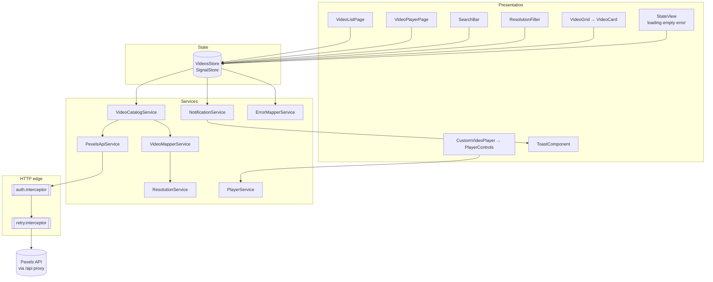
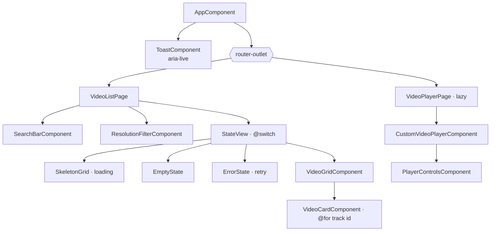
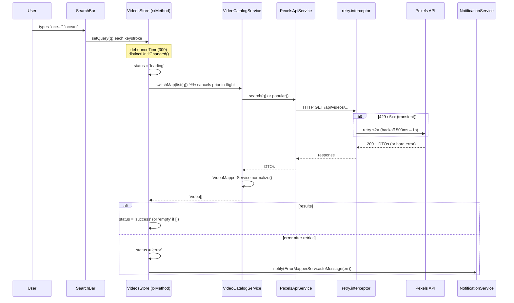
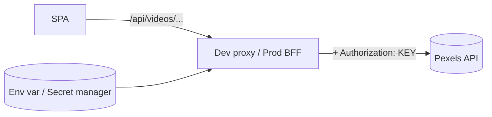

# HLD — Pexels Video Media Player

**Status:** Draft for build · **Owner:** avinoam@ravtech.co.il · **Date:** 2026-06-09
**Related:** [PRD.md](./PRD.md) · `../README.md` · `../AI_NOTES.md`

---

## 1. Overview & goals
A single-page Angular application that fetches videos from the Pexels API, renders them as a
searchable, filterable gallery of cards, and plays a selected video with custom, keyboard-operable
controls. The design optimizes for: precise typing (no `any`), single-responsibility services,
defensive parsing, explicit loading/empty/error states, accessibility, secure key handling, and
minimal re-renders / no redundant requests.

Key non-functional drivers (from the PRD):
- **Type-safe** DTO ↔ domain separation.
- **Resilient** to partial / unsorted / missing API data.
- **Responsive** search via `debounceTime(300) → distinctUntilChanged() → switchMap()`.
- **Secure** — API key never in the client bundle.

---

## 2. Architecture style
Layered, feature-oriented standalone Angular:

- **Presentation** — standalone components (`OnPush`), signals in/out, no business logic.
- **State** — a single NgRx **SignalStore** per feature; holds state only, delegates logic.
- **Domain/Services** — single-responsibility injectable services (HTTP, orchestration, mapping,
  resolution logic, playback, notifications, error mapping).
- **HTTP edge** — functional interceptors (auth header in dev, limited retry/backoff).
- **External** — Pexels API, reached via a dev proxy (`/api/*`) so the key stays server-side.

### 2.1 Layered architecture


---

## 3. Component hierarchy

All presentational components are `ChangeDetectionStrategy.OnPush`, use `input()`/`output()`, and
contain no HTTP or business logic.

---

## 4. Data model (DTO vs domain)
Two distinct layers; the mapper is the only bridge.

**DTO (raw API)** — `core/models/pexels-api.dto.ts`: `PexelsUserDto`, `PexelsVideoFileDto`,
`PexelsVideoPictureDto`, `PexelsVideoDto`, `PexelsVideoListResponseDto`. Fields nullable where the
API is unreliable (`quality`, `width`, `height`, `fps`).

**Domain (normalized)** — `core/models/video.model.ts`:
```ts
type ResolutionLabel = '4K' | '1440p' | '1080p' | '720p' | '480p' | '360p';
interface VideoSource { id; label: ResolutionLabel; width; height; fileType; link; }
interface Video {
  id; title; pageUrl;
  posterUrl: string | null;        // null → placeholder
  authorName: string;              // 'Unknown' fallback
  authorUrl: string | null;
  durationSec: number | null;      // null → hidden
  sources: VideoSource[];          // mp4 only, sorted desc by height
  maxResolution: ResolutionLabel | null;
  playable: boolean;               // false → not selectable
}
```

### 4.1 Defensive mapping rules (`VideoMapperService`)
- `authorName = user?.name?.trim() || 'Unknown'`.
- `durationSec` kept only if finite and > 0, else `null`.
- `posterUrl = image || video_pictures?.[0]?.picture || null`.
- `sources`: from `(video_files ?? [])` → keep entries with a non-empty `link` and a `video/`
  `file_type` (prefer mp4) → derive `label` from `height` (fall back to the video's own height) →
  **sort desc by height** (handles unsorted input) → dedupe by label.
- `maxResolution = sources[0]?.label ?? null`; `playable = sources.length > 0`.
- The list map is guarded so a single malformed record is skipped, never throwing the whole page.

---

## 5. State model (`VideosStore`, NgRx SignalStore)
State slice:
```ts
type Status = 'idle' | 'loading' | 'success' | 'empty' | 'error';
interface VideosState {
  query; resolutionFilter: ResolutionLabel | 'all';
  status: Status; videos: Video[]; error: string | null; selectedId: number | null;
}
```
- **Computed:** `availableResolutions` (union of labels), `filteredVideos` (client-side filter,
  memoized — no refetch), `selectedVideo`.
- **Methods:** `setQuery`, `setResolutionFilter`, `select`, `getById` (deep-link fallback), and the
  `rxMethod` search pipeline below.

### 5.1 Search sequence (debounce → cancel → retry → notify)


---

## 6. Routing
```
''            → redirect → 'videos'
'videos'      → VideoListPage (eager)
'videos/:id'  → VideoPlayerPage (lazy, loadComponent)
'**'          → redirect → 'videos'
```
Card selection → `router.navigate(['videos', id])`: shareable URL, native Back, keyboard-friendly.
The player page reads `selectedVideo` from the store or falls back to `store.getById(id)`.

---

## 7. Error & retry strategy
- **Transient (429, 5xx):** `retry.interceptor` retries **max 2×** with exponential backoff
  (≈500ms → 1s); only for idempotent GETs.
- **Permanent (4xx auth/bad request):** fail fast, no retry.
- **After exhaustion:** `VideosStore` sets `status='error'` (inline state + Retry button) **and**
  calls `NotificationService.notify(...)`; `ErrorMapperService` maps the `HttpErrorResponse` to a
  friendly message (e.g. 429 → "Rate limited — try again shortly", 401 → "API key problem").
- **Toast** is rendered by `ToastComponent` with `role="status"` / `aria-live="polite"`.

---

## 8. API key security
- **Dev:** the Angular bundle calls relative `/api/*`. `proxy.conf.json` forwards to
  `https://api.pexels.com` and **adds the `Authorization` header from an env var** (`PEXELS_API_KEY`).
  The key is never in client JS, never committed (`.gitignore`); `environment.ts` holds only the
  `/api` base path.
- **Prod (documented, not built):** front Pexels with a thin **BFF / serverless proxy** that injects
  the key from a server-side secret (CI/CD secret manager). The SPA calls its own origin; the proxy
  adds auth and can cache / rate-limit. Optional runtime config via `APP_INITIALIZER` — still no
  secret in the client.



---

## 9. Accessibility
- **SearchBar:** labelled `role="searchbox"`, `aria-busy` while loading.
- **VideoCard:** native focusable element, descriptive `aria-label` (author, duration, max
  resolution), Enter/Space to play, visible focus ring.
- **ResolutionFilter:** labelled native `<select>` (or roving-tabindex segmented buttons).
- **PlayerControls:** each control a `<button>` with `aria-label`; seek bar `role="slider"` with
  `aria-valuemin/max/now`; keyboard map Space=play/pause, ←/→=seek, ↑/↓=volume, `m`=mute,
  `f`=fullscreen; focus moves to the player on route entry; `aria-live` announces state changes.

---

## 10. Performance / re-render avoidance
- `debounceTime(300) → distinctUntilChanged() → switchMap()` (cancels in-flight, de-dupes).
- `OnPush` + signals; `filteredVideos` / `availableResolutions` as memoized `computed` — filtering
  triggers **no** network request.
- `@for (...; track v.id)`; posters use `loading="lazy" decoding="async"`.
- Player route lazy-loaded; minimal change-detection surface.

---

## 11. Testing strategy (Karma + Jasmine)
Highest-risk logic first:
1. `VideoMapperService` — unsorted/partial/missing/garbage inputs, mp4 filtering, label boundaries.
2. `VideosStore` — debounce coalescing, dedupe, switchMap cancellation, success/empty/error, filter
   without refetch (`fakeAsync` + `HttpTestingController`).
3. `retry.interceptor` — 2× on 429/5xx, fail-fast on 4xx.
4. `ResolutionService` — label-by-height, union, filter predicate.
5. `DurationPipe` — 0/65/3661/null.
6. `VideoCardComponent` — fields + fallbacks, Enter/Space emits, `aria-label`.

---

## 12. Trade-offs & "with more time"
- **SignalStore over classic NgRx** — less boilerplate, fits signals; classic NgRx would add
  actions/effects ceremony unjustified at this scope.
- **Resolution label from `height`** — pragmatic given inconsistent `quality`; a richer model could
  expose both codec and bitrate.
- **No real BFF** — documented only; out of time-box.
- **With more time:** virtualized grid + pagination/infinite scroll, retry with jitter and `Retry-After`
  honoring, e2e tests (Playwright), more component/a11y tests, runtime config via `APP_INITIALIZER`,
  skeleton polish and reduced-motion support.
